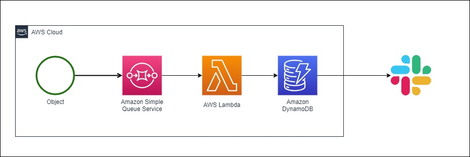

# SQS, Lambda, Slack を使用した通知構成

## 構成図

## 処理の流れ

1. SQSでメッセージを取得
2. Lambda実行
3. メッセージIDの重複チェック
   - 重複があった場合、処理スキップ
4. APIレート制限チェック
   - レート制限に引っ掛かる場合、エクスポネンシャルバックオフ実施
5. Slackに送信
6. DynamoDBに送信時のタイムスタンプ登録

## 注意点

- 事前に無料版でもいいのでslackでワークスペースを作成すること
- slack APIの Incomming Webhook を作成すること
